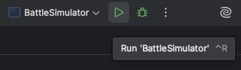
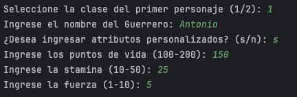
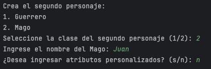
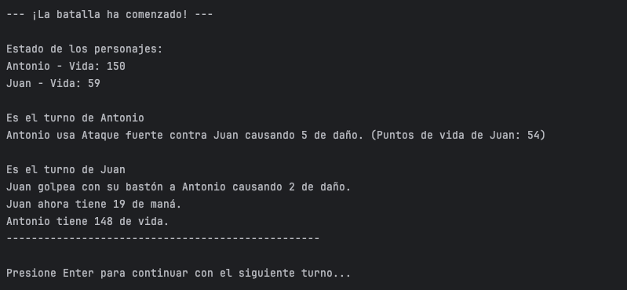
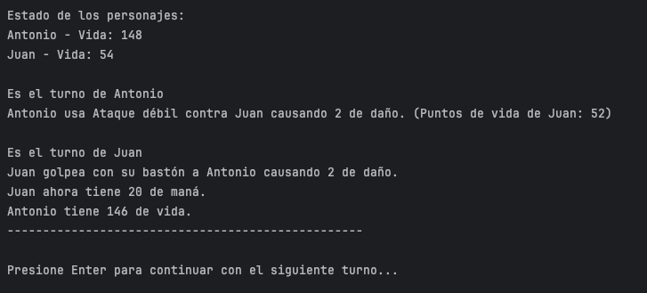
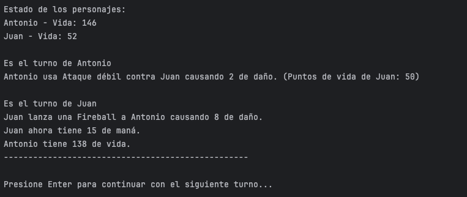
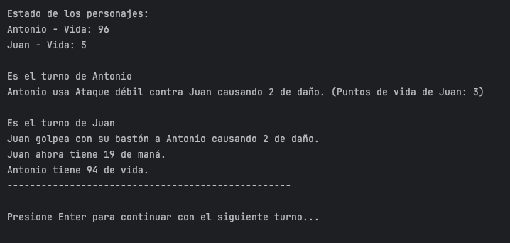
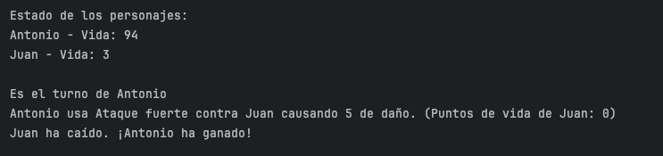

# Ironbattle

---

## ⚜️ Introducción

Este proyecto es un Simulador de Batalla en **Java**, desarrollado con el objetivo de aplicar conceptos de programación orientada a objetos (POO). Permite simular combates por turnos entre dos tipos de personajes:

- **Guerreros (Warriors)**: Físicamente fuertes, con ataques que consumen stamina.

- **Magos (Wizards)**: Usan hechizos y bastones, con ataques basados en maná e inteligencia.

El usuario puede crear personajes personalizados o aleatorios, seleccionar sus clases y observar cómo se desarrolla una batalla automática entre ellos, con mensajes detallados de cada acción 🔥⚔️🧙🏻

Este proyecto también sirve como ejemplo educativo para entender el uso de clases abstractas, interfaces, herencia, encapsulamiento, y polimorfismo en Java.

## 🧩 Estructura del proyecto

- ### Interfaz `Attacker`

  Esta interfaz define el comportamiento que deben implementar todos los personajes que pueden atacar en el simulador de batalla. Su objetivo es establecer un contrato común para diferentes tipos de personajes que participan en combate.  

  **Método único:**

  - **`attack(Character character)`**: Método abstracto que debe ser implementado por cualquier clase que adopte esta interfaz. Define cómo un personaje ataca a otro, recibiendo como parámetro el personaje objetivo del ataque.  

    **Propósito:**

  - Establece un punto de polimorfismo, permitiendo tratar a diferentes tipos de atacantes (guerreros, magos, etc.) de manera uniforme.
  - Facilita la extensibilidad del sistema: se pueden añadir nuevos tipos de personajes que implementen diferentes estrategias de ataque sin modificar el sistema de combate.

- ### Clase `Character`

  Esta clase abstracta sirve como base para todos los personajes del juego. Define los atributos y comportamientos comunes que comparten todas las entidades que pueden participar en combates, como guerreros y magos.  

  **Atributos:**

  - **`id`**: Identificador único (UUID) generado automáticamente para cada personaje.
  - **`name`**: Nombre del personaje.
  - **`hp`**: Puntos de vida del personaje. Cuando llega a cero o menos, el personaje muere.
  - **`isAlive`**: Estado que indica si el personaje está vivo (`true`) o muerto (`false`).  

    **Constructor:**

  - Recibe el nombre y los puntos de vida iniciales.
  - Genera automáticamente un UUID único para el personaje.
  - Inicializa el estado `isAlive` como `true`.  

    **Métodos principales:**

  - **Getters**: Permiten acceder a los atributos privados (`getId()`, `getName()`, `getHp()`, `isAlive()`).
  - **Setters**: Permiten modificar algunos atributos (`setName()`, `setHp()`, `setAlive()`).
  - El método `setHp()` incluye lógica especial que verifica si los puntos de vida han llegado a cero o menos, en cuyo caso establece el estado `isAlive` como `false`.  

    **Características clave:**

  - Es una clase abstracta, por lo que no se puede instanciar directamente.
  - Implementa la interfaz `Attacker`, obligando a las subclases a definir su propio método `attack()`.
  - Proporciona toda la funcionalidad común relacionada con la vida, muerte y gestión de identidad de los personajes.

- ### Clase `Warrior`

  Este archivo contiene la implementación de la clase `Warrior`, que representa a un guerrero en el simulador de batallas RPG. La clase `Warrior` extiende de la clase abstracta `Character` e implementa la interfaz `Attacker`, lo que le permite participar en combates.  

  **Atributos propios:**

  - **`stamina`**: recurso que determina cuántos ataques puede realizar el guerrero. Se genera aleatoriamente entre 10 y 50.
  - **`strength`**: fuerza del guerrero, que determina cuánto daño puede causar. Se genera aleatoriamente entre 1 y 10.  

  **Constructores:**

  - Un constructor permite definir manualmente el **nombre**, la **vida (`hp`)**, la **stamina** y la **fuerza**, validando que estén dentro de los rangos permitidos.
  - Otro constructor genera automáticamente valores aleatorios válidos para **`hp`**, **`stamina`** y **`strength`**.  

  **Método `attack(Character character)`**:

  - El guerrero ataca a otro personaje según su **stamina** disponible:
    - Si tiene **al menos 5 puntos** de stamina y elige aleatoriamente hacer un **ataque fuerte**, causará daño igual a su `strength` y consumirá 5 puntos de stamina.
    - Si no puede hacer un ataque fuerte, pero tiene **al menos 1 punto** de stamina, realizará un **ataque débil**, causando la mitad del daño (`strength / 2`) y recuperando 1 punto de stamina.
    - Si no tiene suficiente stamina ni para un ataque débil, **no causará daño** y recuperará **2 puntos** de stamina.
  - El daño se aplica directamente a los puntos de vida (`hp`) del oponente.
  - Se imprime un mensaje en consola describiendo el tipo de ataque, el daño causado y los puntos de vida restantes del oponente.

- ### Clase `Wizard`

  La clase Wizard representa a un personaje especializado en magia dentro del simulador de batalla. Utiliza su inteligencia para infligir daño y su mana como recurso para lanzar hechizos. Es menos resistente que un guerrero, pero potencialmente más letal gracias a su poder mágico.  

  **Atributos**

  - **`maná (int)`**: Recurso mágico que permite lanzar hechizos (valor aleatorio entre 10 y 50).
  - **`inteligencia (int)`**: Determina el poder ofensivo de los hechizos (valor aleatorio entre 1 y 50).
  - **`hp (int)`**: Salud del mago, puntos de vida. Se genera aleatoriamente entre 50 y 100.
  - **`isAlive (boolean)`**: Estado de vida. Inicia en `true` y se vuelve `false` cuando `hp ≤ 0`.  

  **¿Cuánta vida (hp) tiene un mago?**

  - La vida del mago se asigna de forma **aleatoria entre 50 y 100** al momento de su creación.
  - No se puede modificar ni regenerar durante el combate.  

  **Método principal**  

  `attack(Character objetivo)`  

  Este método implementa la lógica de combate mágico. El mago decide su acción en cada turno según el mana disponible:  

  **🔥 Fireball (Bola de fuego)**

  - Se lanza si el mago tiene al menos 5 puntos de mana y la elección aleatoria lo permite.
  - Daño infligido: igual a su inteligencia.
  - :triángulo_rojo_pequeño_hacia_abajo: Consume 5 puntos de mana.  

  **🦯 Golpe con bastón**

  - Ocurre si: No se lanza una Fireball, o el maná es menor a 5 pero al menos 1.
  - Daño fijo: 2 puntos.
  - :triángulo_rojo_pequeño: Recupera 1 punto de mana.  

  **❌ Sin mana suficiente**

  - Si el mago tiene menos de 1 punto de mana, no ataca.
  - :batería: Recupera 2 puntos de mana.  

  **❔ ¿Puede recuperar vida?**

  No. Los magos no pueden curarse ni regenerar vida (hp) durante la batalla. Solo pueden recuperar mana, dependiendo de su acción en el turno.

## ⚔️ Lógica de la Batalla

### ¿Qué hace este programa?

- Te permite crear 2 personajes: un Warrior (Guerrero) o un Wizard (Mago).
- Puedes elegir si quieres darle tú los atributos (vida, fuerza, etc.) o que el programa los ponga al azar.
- Los personajes se turnan para atacarse hasta que uno muere ⚰️
- Todo pasa en la consola, ¡y tú vas viendo cómo se desarrolla la pelea paso a paso!

### ¿Cómo empiezo?

1. Descarga el repositorio de GitHub.
2. Abre el proyecto con un editor de código, como por ejemplo, `IntelliJ`.
3. Abre el archivo `BattleSimulator.java` e inicialo con **Run**  

   

4. Se abrirá el terminal y el juego se iniciará. Elige si el primer personaje será un guerrero o un mago.
   

5. Dale un nombre y decide si le indicas tú los atributos manualmente o dejas que el azar lo haga por ti.
   
6. Repite el anterior paso para el segundo personaje. En este caso como el primero lo hemos configurado manualmente, con el segundo lo dejaremos al azar para que se vean las dos maneras.
   
7. ¡Y la batalla se iniciará! En las siguientes capturas se puede ver como se van combinando diferentes tipos de ataque y como los puntos de vida y el maná se van reduciendo. Y para avanzar en la batalla tras cada golpe debemos apretar la tecla `Enter`.
   
   
   
   
8. Y así hasta que uno de los personajes resulta ganador.
   

Una vez acabada la batalla el programa finaliza automáticamente. No necesitas gráficos ni botones fancy, solo ganas de ver pelear letras con números 😆

## 📊 Diagrama UML

