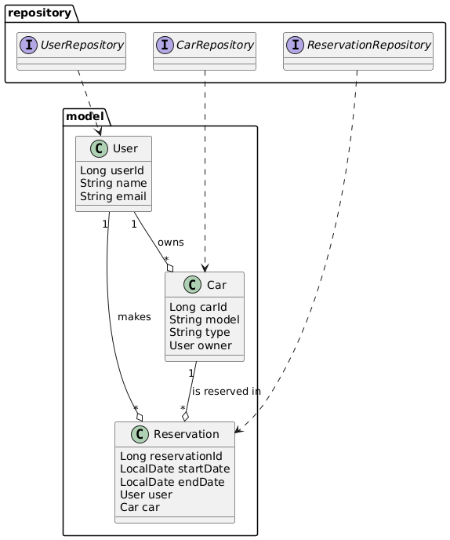

# 🚗 CarBnB API - Spring Boot + MySQL

CarBnB API es una aplicación RESTful desarrollada con **Spring Boot** y **Java** que simula una plataforma de alquiler de coches entre particulares, similar a Airbnb pero para vehículos. Permite gestionar usuarios, coches y reservas, implementando relaciones de herencia y CRUD completo sobre los recursos principales.

## 📚 Requisitos

- Java 17+
- Maven
- MySQL Server
- IDE recomendado: IntelliJ
- Navegador (para probar los endpoints)
- Postman o similar (opcional para pruebas)

## ⚙️ Tecnologías usadas

- Spring Boot (3.5.0)
- Spring Web
- Spring Data JPA
- MySQL
- Maven
- JUnit & Mockito (testing)

## 📁 Estructura del proyecto

    src/main/java/com.example.carbnb
    ├── config                      # Configuración y carga de datos iniciales
    |    └── DataLoader             # Clase para cargar datos iniciales
    ├── controller                  # Controladores REST (API endpoints)
    |    ├── CarController          # Controlador para operaciones de coches
    |    ├── ReservationController  # Controlador para operaciones de reservas
    |    └── UserController         # Controlador para operaciones de usuarios
    ├── model                       # Entidades JPA (User, Car, Reservation, etc.)
    |    ├── Car                    # Entidad coche
    |    ├── Reservation            # Entidad reserva
    |    └── User                   # Entidad usuario
    ├── repository                  # Repositorios Spring Data JPA
    |    ├── CarRepository          # Acceso a datos de coches
    |    ├── ReservationRepository  # Acceso a datos de reservas
    |    └── DataRepository         # Acceso a datos generales
    └── CarbnbApplication.java      # Clase principal de la aplicación

## 📊 Diagrama de Clases



## 🛠️ Setup

1. Instala Java 17 o superior (recomendado JDK 17+):

   - Descarga desde [Adoptium Temurin](https://adoptium.net/temurin/releases/?version=17) o [Oracle JDK](https://www.oracle.com/java/technologies/downloads/).
   - Instala y configura la variable de entorno JAVA_HOME:
     ```powershell
     [System.Environment]::SetEnvironmentVariable('JAVA_HOME', 'C:\Program Files\Java\jdk-24', 'Machine')
     $env:Path += ";C:\Program Files\Java\jdk-24\bin"
     [System.Environment]::SetEnvironmentVariable('Path', $env:Path, 'Machine')
     ```
   - Verifica la instalación:
     ```powershell
     java -version
     echo $env:JAVA_HOME
     ```

2. Instala Maven si no lo tienes ([descargar aquí](https://maven.apache.org/download.cgi)).

   - Verifica con:
     ```powershell
     mvn -version
     ```

3. Clona el repositorio:

   ```bash
   git clone https://github.com/xarlizard/carbnb-api.git
   cd carbnb-api
   ```

4. Inicia el servidor MySQL y crea la base de datos:

   - **MySQL Workbench (guía paso a paso):**
     1. Abre MySQL Workbench.
     2. Haz clic en el ícono de "+" para crear una nueva conexión.
     3. Completa los siguientes campos:
        - **Connection Name:** Carbnb Local
        - **Connection Method:** Standard (TCP/IP)
        - **Hostname:** localhost
        - **Port:** 3306
        - **Username:** root (o el usuario administrador que tengas configurado)
        - **Password:** (haz clic en "Store in Vault..." y pon tu contraseña de MySQL)
     4. Haz clic en "Test Connection" para asegurarte de que la conexión funciona.
     5. Haz clic en "OK" para guardar la conexión.
     6. Selecciona la conexión "Carbnb Local" y haz clic para conectarte.
     7. Abre una nueva pestaña de consulta (Query) y ejecuta:
        ```sql
        CREATE DATABASE carbnb;
        CREATE USER 'carbnb_user'@'localhost' IDENTIFIED BY 'tu_password_segura';
        GRANT ALL PRIVILEGES ON carbnb.* TO 'carbnb_user'@'localhost';
        FLUSH PRIVILEGES;
        ```
     8. Verifica que la base de datos y el usuario se hayan creado correctamente en el panel de la izquierda.
   - **Windows (Servicios/XAMPP/WAMP):**
     ```powershell
     net start MySQL80
     # o
     net start MySQL
     ```
   - **Verifica que MySQL esté corriendo:**
     ```powershell
     netstat -an | Select-String "3306"
     ```
   - **Crea la base de datos y usuario (en consola MySQL):**
     ```sql
     CREATE DATABASE carbnb;
     CREATE USER 'carbnb_user'@'localhost' IDENTIFIED BY 'tu_password_segura';
     GRANT ALL PRIVILEGES ON carbnb.* TO 'carbnb_user'@'localhost';
     FLUSH PRIVILEGES;
     ```
   - Actualiza `src/main/resources/application.properties`:
     ```properties
     spring.datasource.url=jdbc:mysql://localhost:3306/carbnb
     spring.datasource.username=carbnb_user
     spring.datasource.password=tu_password_segura
     ```

5. Instala las dependencias y compila el proyecto:

   ```bash
   mvn clean package
   ```

6. Ejecuta el proyecto:

   ```bash
   mvn spring-boot:run
   # o
   java -jar target/carbnb-api-0.0.1-SNAPSHOT.jar
   ```

7. La aplicación estará disponible en:
   ```
   http://localhost:8080
   ```

## 🌐 Estructura de Controladores y Rutas

### 👤 Usuarios

| Método | Ruta                                | Descripción                                                                |
| ------ | ----------------------------------- | -------------------------------------------------------------------------- |
| GET    | `/users`                            | Listar todos los usuarios                                                  |
| POST   | `/users`                            | Crear usuario                                                              |
| GET    | `/users/{id}`                       | Obtener usuario por ID                                                     |
| PUT    | `/users/{id}`                       | Actualizar usuario                                                         |
| DELETE | `/users/{id}`                       | Eliminar usuario                                                           |
| GET    | `/users/{id}/cars`                  | Listar todos los coches publicados por el usuario                          |
| GET    | `/users/{id}/reservations`          | Listar todas las reservas hechas por el usuario (como renter)              |
| GET    | `/users/{id}/received-reservations` | Listar todas las reservas recibidas (como propietario de coches)           |
| GET    | `/users/{id}/sent-reservations`     | Listar todas las reservas hechas por el usuario (como arrendatario/renter) |

### 🚗 Coches

| Método | Ruta                      | Descripción                                                  |
| ------ | ------------------------- | ------------------------------------------------------------ |
| GET    | `/cars`                   | Listar todos los coches                                      |
| POST   | `/cars`                   | Crear coche                                                  |
| GET    | `/cars/{id}`              | Obtener coche por ID                                         |
| PUT    | `/cars/{id}`              | Actualizar coche                                             |
| DELETE | `/cars/{id}`              | Eliminar coche                                               |
| GET    | `/cars/{id}/reservations` | Listar todas las reservas hechas para ese coche              |
| GET    | `/cars/user/{userId}`     | Listar todos los coches publicados por un usuario específico |
| GET    | `/cars/{id}/renter`       | Ver el usuario que ha alquilado el coche (última reserva)    |
| GET    | `/cars/{id}/owner`        | Ver el propietario del coche                                 |

### 📅 Reservas

| Método | Ruta                              | Descripción                                                                  |
| ------ | --------------------------------- | ---------------------------------------------------------------------------- |
| GET    | `/reservations`                   | Listar todas las reservas                                                    |
| POST   | `/reservations`                   | Crear reserva                                                                |
| GET    | `/reservations/{id}`              | Obtener reserva por ID                                                       |
| PUT    | `/reservations/{id}`              | Actualizar reserva                                                           |
| DELETE | `/reservations/{id}`              | Eliminar reserva                                                             |
| GET    | `/reservations/user/{userId}`     | Listar todas las reservas hechas por un usuario (como renter)                |
| GET    | `/reservations/car/{carId}`       | Listar todas las reservas hechas para un coche específico                    |
| GET    | `/reservations/owner/{ownerId}`   | Listar todas las reservas recibidas por un propietario de coches             |
| GET    | `/reservations/renter/{renterId}` | Listar todas las reservas hechas por un usuario (como arrendatario/renter)   |
| GET    | `/reservations/rentee/{renteeId}` | Listar todas las reservas recibidas por un usuario (como propietario/rentee) |

## 🚀 Futuro

- Implementar autenticación y roles.
- Mejorar validaciones y manejo de errores.
- Añadir filtros avanzados de búsqueda.
- Integrar pagos y valoraciones.

## 📚 Recursos

- [Spring Boot Docs](https://spring.io/projects/spring-boot)
- [JPA Inheritance](https://www.baeldung.com/hibernate-inheritance)
- [MySQL Docs](https://dev.mysql.com/doc/)

## 👤 Codeowner

- [@xarlizard](https://www.github.com/xarlizard)

---

> Los datos se almacenan en MySQL y se borran al eliminar la base de datos. Puedes adaptar el proyecto para otros motores cambiando la configuración en `application.properties`.
